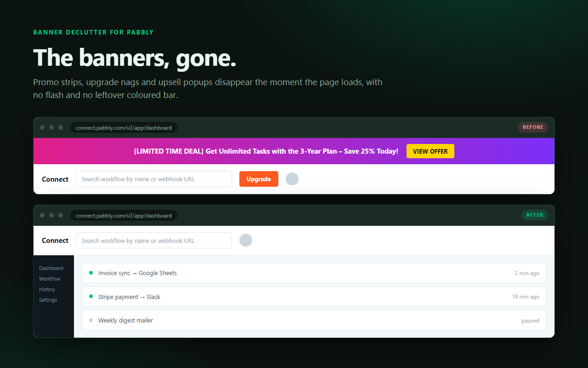
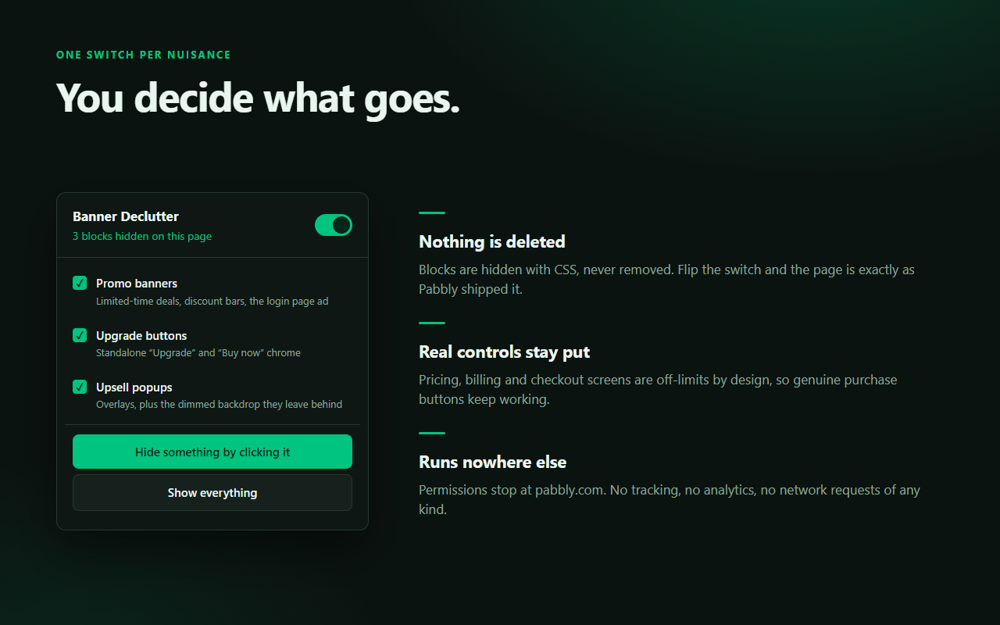
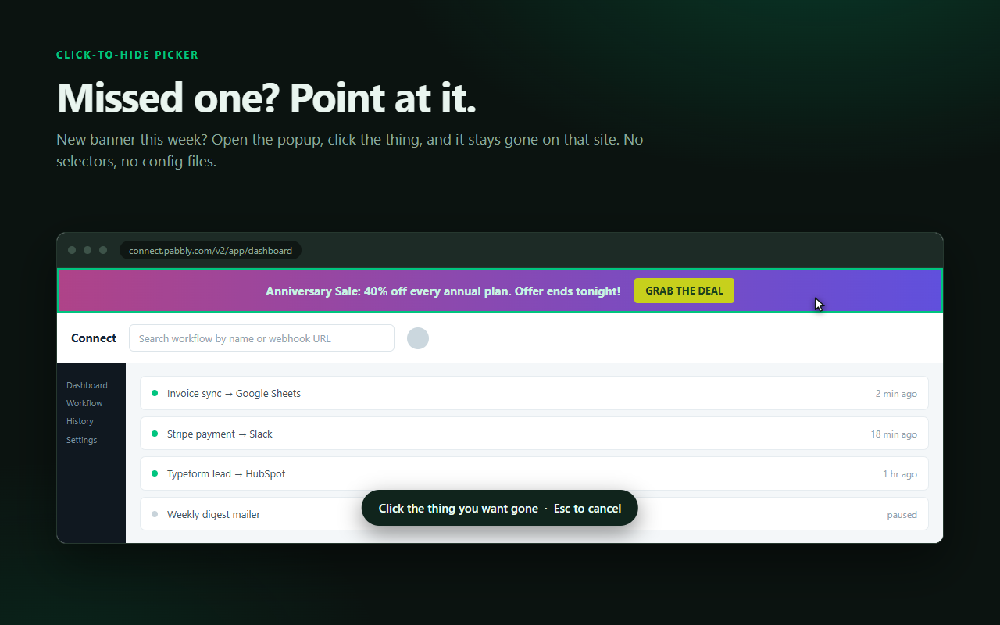

<div align="center">


<br>

[](https://chromewebstore.google.com/detail/banner-declutter-for-pabb/cgjkbnmafmadbefbohfamokaaemjanfc)
[](manifest.json)
[](LICENSE)
[](#what-about-my-data)

### Pabbly Connect is a good tool wrapped in a lot of selling.<br>This gets rid of the selling.

<br>

<a href="https://chromewebstore.google.com/detail/banner-declutter-for-pabb/cgjkbnmafmadbefbohfamokaaemjanfc">

</a>

<br><br>

</div>



<br>

## What goes away

🎯 **The deal strip** — that pink and purple "[LIMITED TIME DEAL] … VIEW OFFER" bar across the top of every page, and the "$99 for all Pabbly apps" panel that fills half the login screen.

🎯 **The upgrade nags** — standalone "Upgrade" and "Buy now" buttons wedged into the app header.

🎯 **The popups** — promo overlays, plus the greyed-out backdrop and the frozen page scroll they leave behind when you dismiss them.

Everything is hidden with CSS, never deleted. Flip the switch off and Pabbly looks exactly as it shipped.

<br>

| Turn things on and off | Or point at whatever they add next |
|:--:|:--:|
|  |  |

<br>

## Install it

**[Add it from the Chrome Web Store](https://chromewebstore.google.com/detail/banner-declutter-for-pabb/cgjkbnmafmadbefbohfamokaaemjanfc)** — one click, and it keeps itself updated.

That's the whole setup. Open Pabbly and the banners are already gone. Tabs you had open beforehand get cleaned up too, so there's nothing to reload.

<br>

## Questions you might reasonably have

**Will it break my workflows?**
No. It hides promotional blocks and nothing else. Pricing, billing and checkout screens are explicitly off-limits, so real purchase buttons keep working — the extension steps over anything containing a form field or sitting inside a billing page.

**What if Pabbly adds a new banner?**
They will. Open the extension, click **"Hide something by clicking it"**, then click the offending thing. It stays gone on that site from then on. **"Reset my picks"** undoes those choices if you overdo it.

<a name="what-about-my-data"></a>
**What about my data?**
There isn't any. The extension makes no network requests of any kind — no tracking, no analytics, no phoning home. Its permissions stop at `pabbly.com`, so it physically cannot see any other site you visit. Your on/off switches live in your own Chrome profile.

**Can I turn it off temporarily?**
Yes. There's a master switch, plus one switch per category, plus a "Show everything" button that restores the page until you reload.

<br>

<details>
<summary><b>How it decides what's an advert</b></summary>

<br>

The naive version — hide anything containing the word "deal" — falls apart immediately. During development, a column holding four harmless cards ("Save 25 records to Sheets", "$29 billed monthly", "Learn more") collected enough stray signal to look promotional, and the entire dashboard column vanished.

So detection runs in two phases:

**1. Seed.** Find the *smallest* blocks that are densely promotional. A block needs strong wording (`limited time deal`, `lifetime access`, `25% off`), or two weaker signals plus a call to action. On top of that, the promo wording has to cover at least 35% of the block's own text. That density test is the important part — a real banner measures around 75% promotional language, an ordinary content column around 12%.

**2. Grow.** Climb outwards from the seed so the whole banner disappears as one unit, instead of leaving an empty coloured strip behind. It only climbs while every neighbour it would swallow is itself promotional or negligible, *and* there's positive evidence the parent really is the banner.

Three things are never touched, at any point: page scaffolding (`body`, `main`, `#root`), any block containing a real form control, and anything inside a genuine pricing, billing or checkout screen.

</details>

<details>
<summary><b>Running it from source</b></summary>

<br>

```bash
git clone https://github.com/Sven-Bo/banner-declutter-for-pabbly.git
```

Then open `chrome://extensions`, turn on **Developer mode**, click **Load unpacked**, and pick the cloned folder.

**Layout**

```
manifest.json          MV3 manifest
src/config.js          Phrases, selectors, thresholds - all frozen, all in one place
src/storage.js         chrome.storage.sync wrapper; every write is a merge, never a mutation
src/hider.js           The only file that touches visibility. Reversible by design
src/scanner.js         Seed-and-grow detection
src/picker.js          Click-to-hide picker and selector generation
src/content.js         Boot, MutationObserver, SPA route changes, popup messages
src/background.js      Injects into tabs that were open at install time
src/inject.css         The hide rule plus picker chrome
popup/                 Toolbar UI
tests/fixture.html     22 assertions against a replica of the real pages
store/                 Listing copy, screenshots and their HTML source
tools/                 Icon, screenshot and packaging scripts
```

**Tests**

`tests/fixture.html` replicates the real Pabbly dashboard and login screens, with the actual banner copy alongside deliberate false-positive bait. It loads the real detection source and asserts both what must vanish and what must survive.

```bash
python -m http.server 8777
```

Open <http://localhost:8777/tests/fixture.html>. It prints PASS/FAIL per case plus the measured score and density of every block, which is how the thresholds in `src/config.js` were chosen.

**Building a release**

```bash
python tools/package.py            # dist/*.zip, ready to upload
python tools/make-screenshots.py   # store/*.png at the store's exact sizes
python tools/make-icons.py         # icons/*.png, pure stdlib
```

The packager fails loudly if the manifest references a file the archive omits, so a broken package can't reach the store. Bump `version` in `manifest.json` before every re-upload. Store listing copy and permission justifications live in [`store/listing.md`](store/listing.md).

Published listing: <https://chromewebstore.google.com/detail/banner-declutter-for-pabb/cgjkbnmafmadbefbohfamokaaemjanfc>
Extension ID: `cgjkbnmafmadbefbohfamokaaemjanfc`

</details>

<br>

---

<div align="center">

MIT licensed · © 2026 Sven Bosau, Bosau Digital LLC

Not affiliated with, endorsed by, or sponsored by Pabbly.<br>
"Pabbly" is a trademark of its respective owner, used here only to describe what this extension works with.

</div>
